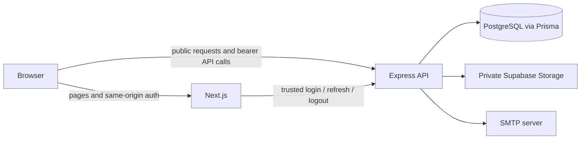

# Fileora

> Your files. Organized your way.

## Project overview

Fileora is a full-stack private file manager built as a TypeScript monorepo. Users can register and verify an email address, maintain a renewable session, upload and organize files in folders, search and sort their library, preview or download owned content, and inspect storage statistics. Administrators receive a separate metadata-only workspace for user management, file cleanup, platform statistics, and sanitized audit history.

The project deliberately separates presentation from authority. Next.js owns the browser experience and a small authentication gateway; Express owns authentication, authorization, business rules, database mutations, and access to the private object store.

## Hosted application

| Service | Provider | Production URL |
| --- | --- | --- |
| Frontend | Vercel | [https://fileora-wheat.vercel.app](https://fileora-wheat.vercel.app) |
| Backend API | Render | [https://managing-your-files.onrender.com](https://managing-your-files.onrender.com) |
| Backend health | Render | [https://managing-your-files.onrender.com/health](https://managing-your-files.onrender.com/health) |

The frontend, API liveness response, and exact-origin CORS preflight from the Vercel origin were verified on 27 August 2026. A production release must still run the committed Prisma migrations before serving the corresponding application version.

## Implemented features

### User workspace

- Registration, SMTP-delivered eight-digit email verification, and abuse-limited resend
- Short-lived JWT access tokens with rotating, independently revocable refresh sessions
- Drag-and-drop or picker-based upload queues with progress and per-file retry
- Server-verified PDF, text, JPEG, PNG, WebP, and DOCX uploads up to 5 MiB each
- A 100 MiB per-user quota and batches of up to ten sequential uploads
- Nested folders (up to ten levels), breadcrumbs, rename, empty-folder deletion, and file moves
- Owner-scoped search, type filters, sorting, pagination, metadata details, preview, and download
- PDF and UTF-8 text extraction where extraction succeeds within configured bounds
- File counts, storage usage, type distribution, and a 30-day upload history
- Responsive layouts, light/dark/system themes, accessible dialogs, and explicit loading/error states

### Administrator workspace

- Searchable, paginated user directory and safe user details
- Role changes with stale-state, self-change, and last-administrator safeguards
- Permanent user deletion with typed confirmation and owned-object cleanup
- Global file metadata browsing and confirmed permanent deletion
- Exact current platform statistics and sanitized audit-event history
- No administrator preview, download, storage-key, or extracted-content capability

Deletion is permanent. The current schema and UI do not implement Trash, restore, or soft deletion. Logout revokes the presented browser session only; there is no logout-all-devices endpoint.

## Technologies used

| Area        | Implementation                                                             |
| ----------- | -------------------------------------------------------------------------- |
| Frontend    | Next.js 16 App Router, React 19, TypeScript, Tailwind CSS 4, Framer Motion |
| Client data | TanStack React Query 5, Axios, Zod-backed shared contracts                 |
| Backend     | Express 5, TypeScript, Zod validation, Multer                              |
| Security    | Argon2id passwords/codes, HS256 JWT access tokens, opaque refresh tokens   |
| Persistence | PostgreSQL, Prisma ORM 7 and committed migrations                          |
| Files       | Private Supabase Storage through a server-side storage adapter             |
| Email       | Nodemailer over SMTP                                                       |
| Testing     | Vitest, Supertest, Testing Library, Playwright, axe-core                   |
| Delivery    | Multi-stage Dockerfiles and Docker Compose                                 |

## Architecture at a glance



The Next.js Backend for Frontend (BFF) is intentionally limited to `/api/auth/login`, `/api/auth/refresh`, and `/api/auth/logout`. It stores the raw refresh credential in a same-origin `HttpOnly` cookie and never returns it to browser JavaScript. The browser keeps the returned access token in memory and sends it directly to Express as a bearer token for normal API calls. Express revalidates the current database user and role on every protected request.

See [System Architecture](docs/architecture.md) for the boundaries and representative request flows.

## Folder structure

```text
client/       Next.js application, BFF routes, feature modules, and frontend tests
server/       Express API, domain services, infrastructure adapters, Prisma, and backend tests
packages/     Shared contracts plus workspace-wide TypeScript and ESLint configuration
scripts/      Verification and local UI-test support scripts
tests/        Cross-application integration, security, and Playwright tests
docs/         System-wide, frontend, and backend developer documentation
```

For detailed placement guidance, see the [client folder structure](docs/client/folder-structure.md) and [server folder structure](docs/server/folder-structure.md).

## Prerequisites

- Node.js 24.x (`package.json` requires `>=24 <25`)
- Corepack and pnpm 10.17.1
- PostgreSQL reachable through `DATABASE_URL`
- An SMTP server or local SMTP/mail-catcher service
- A private Supabase Storage bucket and server-only secret key
- Docker with Compose, if using the container workflow

## Setup instructions

From a fresh clone:

```powershell
corepack enable
pnpm install --frozen-lockfile
Copy-Item -LiteralPath 'client/.env.example' -Destination 'client/.env.local'
Copy-Item -LiteralPath 'server/.env.example' -Destination 'server/.env'
```

Replace all placeholders in the two local environment files. The client trust secret must match the server trust secret, both refresh-token lifetimes must match, PostgreSQL must exist, and the configured Supabase bucket must be private.

## Environment variables

The client reads `client/.env.local` (copy it from `client/.env.example`), while Express reads `server/.env` (copy it from `server/.env.example`). Never commit populated environment files or expose server-side secrets through a `NEXT_PUBLIC_` variable.

### Client and authentication gateway

| Variable                   | Purpose                                                                    |
| -------------------------- | -------------------------------------------------------------------------- |
| `NEXT_PUBLIC_API_BASE_URL` | Browser-reachable Express origin; this is the only browser-public setting. |
| `AUTH_API_BASE_URL`        | Express origin used by server-side Next.js authentication routes.          |
| `AUTH_BFF_SHARED_SECRET`   | Server-only trust secret; must match `BFF_SHARED_SECRET`.                  |
| `REFRESH_COOKIE_NAME`      | Host-only refresh-cookie name.                                             |
| `REFRESH_COOKIE_PATH`      | Cookie path; must be `/api/auth`.                                          |
| `REFRESH_COOKIE_SAME_SITE` | Cookie `SameSite` policy: `strict`, `lax`, or `none`.                      |
| `REFRESH_COOKIE_SECURE`    | Use `false` for local HTTP and `true` in production.                       |
| `REFRESH_TOKEN_TTL`        | Refresh-cookie lifetime; must match the server value.                      |

### Server

| Group                        | Variables                                                                                                                                        |
| ---------------------------- | ------------------------------------------------------------------------------------------------------------------------------------------------ |
| Runtime and database         | `PORT`, `DATABASE_URL`                                                                                                                           |
| Authentication and CORS      | `JWT_ACCESS_SECRET`, `ACCESS_TOKEN_TTL`, `REFRESH_TOKEN_TTL`, `BFF_SHARED_SECRET`, `CORS_ALLOWED_ORIGINS`                                        |
| Email                        | `EMAIL_FROM`, `SMTP_HOST`, `SMTP_PORT`, `SMTP_SECURE`, `SMTP_USER`, `SMTP_PASSWORD`                                                              |
| Initial administrator        | `ADMIN_EMAIL`, `ADMIN_PASSWORD`, `ADMIN_NAME`                                                                                                    |
| Private object storage       | `SUPABASE_URL`, `SUPABASE_SECRET_KEY`, `SUPABASE_STORAGE_BUCKET`                                                                                 |
| Upload and extraction policy | `UPLOAD_MAX_FILE_SIZE_BYTES`, `USER_STORAGE_QUOTA_BYTES`, `UPLOAD_ALLOWED_MIME_TYPES`, `UPLOAD_MAX_FILES_PER_BATCH`, `FILE_EXTRACTION_MAX_BYTES` |

Secrets must be at least as strong as the validation described in the examples. `CORS_ALLOWED_ORIGINS` accepts explicit origins, not wildcards. The upload-policy values are currently fixed by application validation, so changing only their environment values will make startup fail. See [Development Setup](docs/development.md#environment-variables) for the complete variable-by-variable reference.

Docker Compose instead reads an ignored root `.env`; create it from the committed root `.env.example`. The Compose template includes the required application and PostgreSQL variables, uses the `postgres` service hostname in `DATABASE_URL`, and keeps `NEXT_PUBLIC_API_BASE_URL` reachable from the browser.

## Database migration steps

Create the PostgreSQL database named by `DATABASE_URL`, then generate Prisma Client and apply the committed migrations:

```powershell
pnpm --filter @gold-era/server prisma:generate
pnpm --filter @gold-era/server prisma:migrate:deploy
```

Bootstrap the initial administrator after the schema is ready:

```powershell
pnpm --filter @gold-era/server admin:bootstrap
```

Use `prisma:migrate:deploy` in local and production-like environments; do not replace committed migrations with `prisma db push`. The following reset command is only for a disposable development database because it permanently deletes its data:

```powershell
pnpm --filter @gold-era/server prisma:migrate:reset
```

Migration history and schema-change guidance are in [Database and Prisma](docs/database.md).

## Launching the application

### Using regular pnpm

After setup and migrations, start all workspaces from the repository root:

```powershell
pnpm dev
```

Next.js defaults to `http://localhost:3000`; the example server configuration uses `http://localhost:3001`. The root `predev` hook builds `@gold-era/contracts` before the parallel development processes start.

To run the applications separately, build the shared contracts once, then start the server and client commands in two different terminals:

```powershell
pnpm contracts:build
```

```powershell
pnpm --filter @gold-era/server dev
```

```powershell
pnpm --filter @gold-era/client dev
```

Open `http://localhost:3000` in your browser. Keep both development processes running; the frontend calls the Express API configured by `NEXT_PUBLIC_API_BASE_URL` (the example uses `http://localhost:3001`). Stop the processes with `Ctrl+C`.

### Using Docker Compose

Docker Compose launches PostgreSQL, applies all committed Prisma migrations, starts Express, and then starts Next.js. Create its ignored root environment file from the Compose-ready template:

```powershell
Copy-Item -LiteralPath '.env.example' -Destination '.env'
```

Replace every placeholder in `.env`. Keep `POSTGRES_DB`, `POSTGRES_USER`, and `POSTGRES_PASSWORD` synchronized with `DATABASE_URL`; its hostname must remain `postgres`. Ensure `NEXT_PUBLIC_API_BASE_URL` is reachable by the host browser (normally `http://localhost:3001`). You can optionally validate the resolved Compose configuration before building and launching the stack:

```powershell
# Optional preflight validation
docker compose config

# Build and launch
docker compose up --build
```

Open `http://localhost:3000` after the services become healthy. Press `Ctrl+C` to stop an attached run, then remove the stopped containers and network while retaining PostgreSQL data:

```powershell
docker compose down
```

The named `fileora-postgres` volume preserves database data. Do not add `--volumes` unless you intentionally want to delete the local database.

Detailed setup, configuration, debugging, and common change recipes are in [Development](docs/development.md).

## Verification commands

```powershell
pnpm lint
pnpm typecheck
pnpm test
pnpm test:integration
pnpm test:security
pnpm test:e2e
pnpm build
```

`pnpm test` runs unit, contract, and component projects. Database integration tests require `DATABASE_URL` and reset their configured database, so use a disposable migrated database. Playwright requires the client, API, PostgreSQL, and mail service described in [Testing](docs/testing.md). There is no repository `format` script; linting and type checking are the maintained static checks.

## Deployment instructions

The supported deployment artifacts are the multi-stage root `Dockerfile` for Express and migrations, and `client/Dockerfile` for the Next.js application.

The current production topology is Vercel for the frontend and Render for the Express API. See the [hosted application](#hosted-application) links above and [Deployment](docs/deployment.md) for configuration, release order, verification, and operational responsibilities.

For the supplied container topology, copy the root `.env.example` to `.env`, replace every placeholder with production-appropriate values, then build and start it. You can run `docker compose config` first as an optional preflight validation.

`compose.yaml` starts PostgreSQL, runs Prisma migrations once, then starts Express and Next.js after dependency health checks pass. The root template contains every variable consumed by Compose.

```powershell
# Optional preflight validation
docker compose config

# Build and launch
docker compose up --build
```

Stop without deleting the named PostgreSQL volume:

```powershell
docker compose down
```

For independently hosted services:

1. Provision PostgreSQL, a private Supabase Storage bucket, SMTP, backups, TLS, DNS, and a secret manager.
2. Configure the environment variables above. Set `REFRESH_COOKIE_SECURE=true`, use exact frontend origins for CORS, and keep the public API URL browser-reachable.
3. Run `pnpm --filter @gold-era/server prisma:migrate:deploy` as a one-shot release job.
4. Deploy Express and verify `GET /health`.
5. Build and deploy Next.js with the final `NEXT_PUBLIC_API_BASE_URL`; Next.js embeds this value at build time.
6. Smoke-test registration email, login, refresh, logout, owner isolation, uploads, and administrator authorization.

See [Deployment](docs/deployment.md) before using production URLs, TLS, cookies, CORS, migrations, hosted secrets, backups, or rolling releases.

## Assumptions

- PostgreSQL is the source of truth for identities and metadata; Supabase is used only for private binary-object storage.
- The configured Supabase bucket already exists, is private, and is accessible with a server-only secret key.
- SMTP credentials point to a working provider or local mail catcher; verification codes are sent by email and are not logged.
- The frontend and API are deployed behind TLS in production, and the proxy preserves the host and forwarding headers used by same-origin checks.
- A deployment platform supplies secret management, database/object backups, monitoring, and release orchestration because those facilities are not defined in this repository.
- Current deletion behavior is permanent; there is no Trash, restore workflow, or soft deletion.

## Important design decisions

- **Express is the authority.** Client route guards improve navigation, but only Express decides whether a request is authenticated, authorized, and owner-scoped.
- **Refresh credentials are browser-unreadable.** Next.js holds them in an `HttpOnly` cookie; access tokens remain in memory and are renewed after reload or a qualifying `401`.
- **Files and metadata have different homes.** Supabase stores binary objects; PostgreSQL stores ownership, names, sizes, locations, extracted text, sessions, and audit rows.
- **Storage is behind a port.** Domain services depend on `StoragePort`, keeping provider details out of controllers and enabling deterministic fake-storage tests.
- **Shared contracts are explicit.** `packages/contracts` contains browser-safe public schemas and a separate internal auth contract used only across the trusted BFF boundary.
- **Deletion is object-first.** File metadata is removed only after the storage object is absent; upload metadata failures trigger best-effort object compensation.

## Documentation

If you need more details on a particular topic, check `docs/` or the relevant file inside it, if one exists.

New to the project? Read in this order:

1. [System Architecture](docs/architecture.md)
2. [Development Setup](docs/development.md)
3. [Authentication](docs/authentication.md)
4. [Authorization](docs/authorization.md)
5. [File Storage](docs/file-storage.md)
6. [Database](docs/database.md)
7. [Testing](docs/testing.md)
8. [Deployment](docs/deployment.md)

### Frontend

- [Frontend Overview](docs/client/overview.md)
- [Frontend Folder Structure](docs/client/folder-structure.md)
- [Routing](docs/client/routing.md)
- [API and Data Fetching](docs/client/api-and-data-fetching.md)
- [Components and State](docs/client/components-and-state.md)

### Backend

- [Backend Overview](docs/server/overview.md)
- [Backend Folder Structure](docs/server/folder-structure.md)
- [Request Lifecycle](docs/server/request-lifecycle.md)
- [API Reference and Conventions](docs/server/api.md)
- [Services and Data Access](docs/server/services-and-data-access.md)
