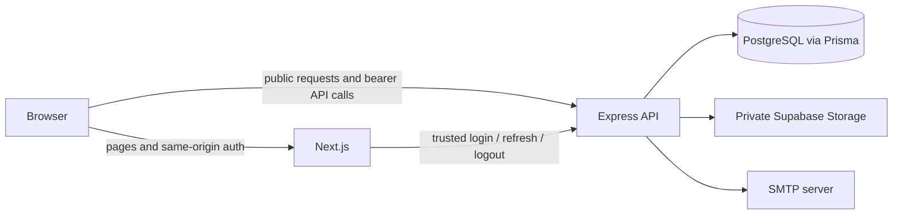

# Fileora

> Your files. Organized your way.

Fileora is a full-stack private file manager built as a TypeScript monorepo. Users can register and verify an email address, maintain a renewable session, upload and organize files in folders, search and sort their library, preview or download owned content, and inspect storage statistics. Administrators receive a separate metadata-only workspace for user management, file cleanup, platform statistics, and sanitized audit history.

The project deliberately separates presentation from authority. Next.js owns the browser experience and a small authentication gateway; Express owns authentication, authorization, business rules, database mutations, and access to the private object store.

## Implemented features

### User workspace

- Registration, SMTP-delivered eight-digit email verification, and abuse-limited resend
- Short-lived JWT access tokens with rotating, independently revocable refresh sessions
- Drag-and-drop or picker-based upload queues with progress and per-file retry
- Server-verified PDF, text, JPEG, PNG, WebP, and DOCX uploads up to 5 MiB each
- A 100 MiB per-user quota and batches of up to ten sequential uploads
- Nested folders (up to ten levels), breadcrumbs, rename, empty-folder deletion, and file moves
- Owner-scoped search, type filters, sorting, pagination, metadata details, preview, and download
- PDF and UTF-8 text extraction where extraction succeeds within configured bounds
- File counts, storage usage, type distribution, and a 30-day upload history
- Responsive layouts, light/dark/system themes, accessible dialogs, and explicit loading/error states

### Administrator workspace

- Searchable, paginated user directory and safe user details
- Role changes with stale-state, self-change, and last-administrator safeguards
- Permanent user deletion with typed confirmation and owned-object cleanup
- Global file metadata browsing and confirmed permanent deletion
- Exact current platform statistics and sanitized audit-event history
- No administrator preview, download, storage-key, or extracted-content capability

Deletion is permanent. The current schema and UI do not implement Trash, restore, or soft deletion. Logout revokes the presented browser session only; there is no logout-all-devices endpoint.

## Technology stack

| Area | Implementation |
| --- | --- |
| Frontend | Next.js 16 App Router, React 19, TypeScript, Tailwind CSS 4, Framer Motion |
| Client data | TanStack React Query 5, Axios, Zod-backed shared contracts |
| Backend | Express 5, TypeScript, Zod validation, Multer |
| Security | Argon2id passwords/codes, HS256 JWT access tokens, opaque refresh tokens |
| Persistence | PostgreSQL, Prisma ORM 7 and committed migrations |
| Files | Private Supabase Storage through a server-side storage adapter |
| Email | Nodemailer over SMTP |
| Testing | Vitest, Supertest, Testing Library, Playwright, axe-core |
| Delivery | Multi-stage Dockerfiles and Docker Compose |

## Architecture at a glance



The Next.js Backend for Frontend (BFF) is intentionally limited to `/api/auth/login`, `/api/auth/refresh`, and `/api/auth/logout`. It stores the raw refresh credential in a same-origin `HttpOnly` cookie and never returns it to browser JavaScript. The browser keeps the returned access token in memory and sends it directly to Express as a bearer token for normal API calls. Express revalidates the current database user and role on every protected request.

See [System Architecture](docs/architecture.md) for the boundaries and representative request flows.

## Repository structure

```text
client/       Next.js application, BFF routes, feature modules, and frontend tests
server/       Express API, domain services, infrastructure adapters, Prisma, and backend tests
packages/     Shared contracts plus workspace-wide TypeScript and ESLint configuration
scripts/      Verification and local UI-test support scripts
tests/        Cross-application integration, security, and Playwright tests
docs/         System-wide, frontend, and backend developer documentation
```

For detailed placement guidance, see the [client folder structure](docs/client/folder-structure.md) and [server folder structure](docs/server/folder-structure.md).

## Prerequisites

- Node.js 24.x (`package.json` requires `>=24 <25`)
- Corepack and pnpm 10.17.1
- PostgreSQL reachable through `DATABASE_URL`
- An SMTP server or local SMTP/mail-catcher service
- A private Supabase Storage bucket and server-only secret key
- Docker with Compose, if using the container workflow

## Quick start

From a fresh clone:

```powershell
corepack enable
pnpm install --frozen-lockfile
Copy-Item -LiteralPath 'client/.env.example' -Destination 'client/.env.local'
Copy-Item -LiteralPath 'server/.env.example' -Destination 'server/.env'
```

Replace all placeholders in the two local environment files. The client trust secret must match the server trust secret, both refresh-token lifetimes must match, PostgreSQL must exist, and the configured Supabase bucket must be private.

Prepare the database and administrator:

```powershell
pnpm --filter @gold-era/server prisma:generate
pnpm --filter @gold-era/server prisma:migrate:deploy
pnpm --filter @gold-era/server admin:bootstrap
```

Start all workspaces:

```powershell
pnpm dev
```

Next.js defaults to `http://localhost:3000`; the example server configuration uses `http://localhost:3001`. The root `predev` hook builds `@gold-era/contracts` before the parallel development processes start.

Detailed setup, configuration, debugging, and common change recipes are in [Development](docs/development.md).

## Verification commands

```powershell
pnpm lint
pnpm typecheck
pnpm test
pnpm test:integration
pnpm test:security
pnpm test:e2e
pnpm build
```

`pnpm test` runs unit, contract, and component projects. Database integration tests require `DATABASE_URL` and reset their configured database, so use a disposable migrated database. Playwright requires the client, API, PostgreSQL, and mail service described in [Testing](docs/testing.md). There is no repository `format` script; linting and type checking are the maintained static checks.

## Docker

`compose.yaml` starts PostgreSQL, runs Prisma migrations once, then starts Express and Next.js after dependency health checks pass. Compose reads a root `.env`; supply every required server and client value plus `POSTGRES_DB`, `POSTGRES_USER`, `POSTGRES_PASSWORD`, and `POSTGRES_PORT`.

```powershell
docker compose config
docker compose build
docker compose up
```

Stop without deleting the named PostgreSQL volume:

```powershell
docker compose down
```

See [Deployment](docs/deployment.md) before using production URLs, TLS, cookies, CORS, migrations, or hosted secrets.

## Important design decisions

- **Express is the authority.** Client route guards improve navigation, but only Express decides whether a request is authenticated, authorized, and owner-scoped.
- **Refresh credentials are browser-unreadable.** Next.js holds them in an `HttpOnly` cookie; access tokens remain in memory and are renewed after reload or a qualifying `401`.
- **Files and metadata have different homes.** Supabase stores binary objects; PostgreSQL stores ownership, names, sizes, locations, extracted text, sessions, and audit rows.
- **Storage is behind a port.** Domain services depend on `StoragePort`, keeping provider details out of controllers and enabling deterministic fake-storage tests.
- **Shared contracts are explicit.** `packages/contracts` contains browser-safe public schemas and a separate internal auth contract used only across the trusted BFF boundary.
- **Deletion is object-first.** File metadata is removed only after the storage object is absent; upload metadata failures trigger best-effort object compensation.

## Documentation

New to the project? Read in this order:

1. [System Architecture](docs/architecture.md)
2. [Development Setup](docs/development.md)
3. [Authentication](docs/authentication.md)
4. [Authorization](docs/authorization.md)
5. [File Storage](docs/file-storage.md)
6. [Database](docs/database.md)
7. [Testing](docs/testing.md)
8. [Deployment](docs/deployment.md)

### Frontend

- [Frontend Overview](docs/client/overview.md)
- [Frontend Folder Structure](docs/client/folder-structure.md)
- [Routing](docs/client/routing.md)
- [API and Data Fetching](docs/client/api-and-data-fetching.md)
- [Components and State](docs/client/components-and-state.md)

### Backend

- [Backend Overview](docs/server/overview.md)
- [Backend Folder Structure](docs/server/folder-structure.md)
- [Request Lifecycle](docs/server/request-lifecycle.md)
- [API Reference and Conventions](docs/server/api.md)
- [Services and Data Access](docs/server/services-and-data-access.md)
