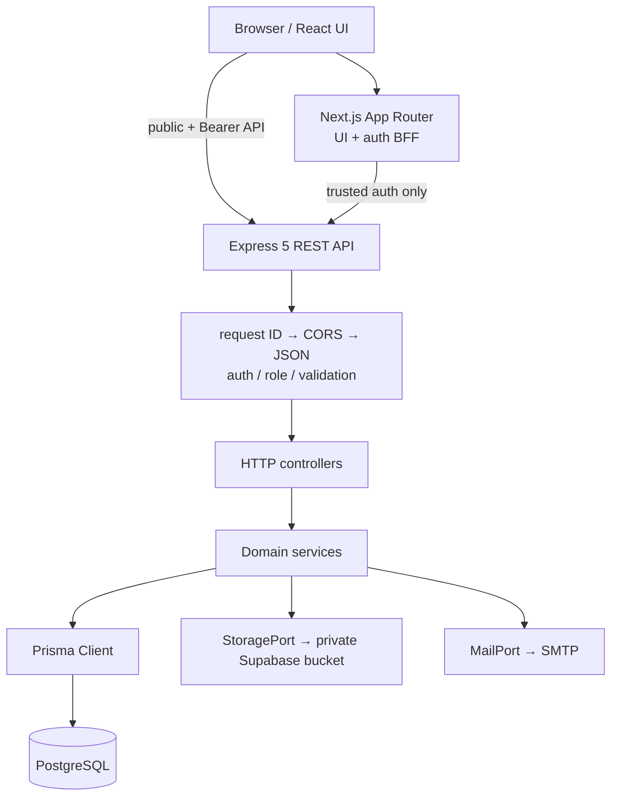
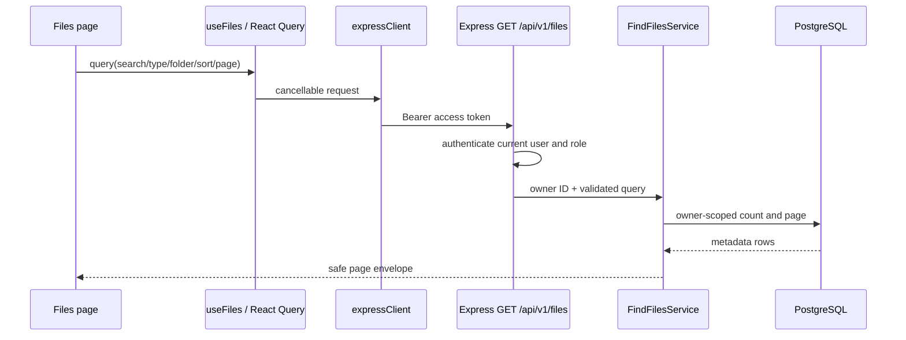

# System architecture

Fileora is a pnpm workspace containing a Next.js browser application, an Express REST authority, shared runtime contracts, and cross-application tests. The split is meaningful: the frontend owns presentation and browser coordination, while Express owns identity, permissions, business rules, data persistence, and private-file access.

## Functional areas

- **Identity:** registration, email verification, login, token rotation, session restoration, and current-session logout.
- **Personal files:** policy discovery, upload, metadata search, sorting, pagination, folders, moves, preview, download, deletion, quota, and statistics.
- **Administration:** metadata-only file oversight, user role and lifecycle management, platform statistics, and sanitized audit history.
- **Operational boundaries:** validated configuration, exact-origin CORS, SMTP, PostgreSQL/Prisma, private Supabase Storage, request IDs, and safe error envelopes.

## Runtime topology



### `client/`

The Next.js workspace renders public, authenticated, and administrator pages. Feature API modules and React Query hooks coordinate remote data, while a memory-only auth store holds the access session. Three Route Handlers form a narrow Backend for Frontend (BFF): login, refresh, and logout. The BFF is the only browser-facing code allowed to handle the raw refresh credential.

### `server/`

The Express workspace exposes versioned public APIs under `/api/v1`, trusted BFF-only auth endpoints under `/internal/v1/auth`, and `/health`. Middleware validates origin policy, bearer identity, role, and request data. Controllers translate HTTP into service calls; services enforce rules and coordinate repositories, Prisma, storage, extraction, mail, and audit logging.

### `packages/`

`packages/contracts` contains Zod schemas and TypeScript types shared across workspaces. Its `public` export is safe for browser-visible request and response shapes. Its separate `internal` export contains the response that includes a raw refresh token and is used only between Next.js server code and Express. The remaining packages centralize strict TypeScript and ESLint settings.

### `scripts/`

These are repository verification and test-support programs: comment-intent auditing, the phase verification runner, UI performance measurement, and a UI test server launcher. They are useful engineering artifacts, not runtime application layers.

### `tests/`

Root tests exercise cross-workspace behavior: browser journeys, security/configuration contracts, and container smoke behavior. Workspace-local tests cover client components and BFF handlers plus server units, contracts, security boundaries, and database-backed integration flows.

## Sources of authority

| Concern | Authoritative layer | Supporting layer |
| --- | --- | --- |
| Authentication | Express token/session services and middleware | Next.js BFF protects refresh material; client restores memory state |
| Authorization | Express role checks and owner-scoped service/repository queries | Client layouts hide or redirect inaccessible UI |
| Business rules | Express domain services | Client performs early usability checks using server-advertised policy |
| Database mutations | Express services/repositories through Prisma | Shared contracts describe inputs and safe outputs |
| File-object operations | Express services through `StoragePort` | Client streams uploads and displays progress |
| Server state | PostgreSQL and Supabase Storage | React Query caches responses and invalidates after mutations |
| UI state | React components, context providers, and memory auth store | URL query parameters hold selected admin filters/pagination |

## Major request flows

### Loading the current user's files



The storage key and extracted content are not returned in collection summaries. A detail request may return extracted text, but only after the file has been selected through an owner-scoped query.

### Uploading files

The UI accepts drag/drop or file-picker selections, loads `/api/v1/files/policy`, and checks advertised MIME, size, batch, and remaining-quota limits before queuing. The queue uploads one file per request so an earlier success remains committed if a later item fails.

```text
UploadDropzone → useUploadQueue → uploadFile (Axios progress)
  → POST /api/v1/files (Bearer + multipart field "file")
  → authenticate → Multer temporary file → controller field validation
  → UploadFileService
      → inspect bytes and detect MIME
      → lock owner and check folder/quota
      → StoragePort.upload generated object key
      → bounded PDF/text extraction (best effort)
      → Prisma FILE metadata insert
      → best-effort audit append
  → temporary file cleanup after response
  → UI refetches files and upload policy
```

The server, not the browser-reported MIME type, makes the final type decision from file bytes. See [File Storage](file-storage.md) for consistency behavior.

### Restoring a session after reload

Browser JavaScript loses its memory-only access token on reload. `AuthProvider` calls the same-origin `/api/auth/refresh` BFF route. Next.js reads the `HttpOnly` refresh cookie, forwards the raw value to Express with the shared trust header, stores the rotated replacement cookie, and returns only a safe access session to the browser. Concurrent renewal calls share one promise to avoid replaying the same rotating token.

### Administrator role change

The admin page sends a bearer-authenticated `PATCH /api/v1/admin/users/:userId/role` with the target role and observed `updatedAt`. Express authenticates the current database authority, requires role `ADMIN`, validates the request, and runs a serializable guarded update. Self-changes and demoting the last administrator are rejected. A successful change revokes all refresh sessions for the target and appends a best-effort audit event; client caches for users, statistics, and audit history are invalidated.

## Persistence and object storage

PostgreSQL is the source of truth for users, refresh-token hashes, verification-code hashes, folder hierarchy, file metadata, extracted text, and audit rows. Supabase Storage contains only file objects addressed by generated keys of the form `users/{ownerId}/files/{fileId}`. The bucket must be private; only the server receives the Supabase secret key.

This separation avoids putting large objects in relational tables while retaining relational ownership, folders, queries, quota accounting, and audit relationships. Storage access is behind `StoragePort`, so domain services do not depend directly on Supabase APIs.

## Authentication and authorization boundaries

The browser can call Express public registration endpoints and bearer-protected application endpoints. It cannot call trusted auth endpoints without `BFF_SHARED_SECRET`, and the raw refresh value is never returned by the BFF. Every protected Express request verifies the JWT signature, algorithm, issuer, audience, expiry, subject, and role, then reloads the verified user from PostgreSQL and requires the database role to match the claim.

File and folder services scope reads and mutations by `ownerId`. Missing and cross-owner resources converge on the same not-found response. Administrator endpoints add server-side role middleware; administrative file APIs expose metadata and deletion only, not content routes.

Read [Authentication](authentication.md) and [Authorization](authorization.md) for complete flows.

## Error flow

Expected service, validation, Multer, and authorization failures become a stable JSON error envelope with a request ID. Unexpected failures are logged server-side and returned as a redacted `503`.

```text
Service / middleware / Prisma / provider failure
  → Express error middleware
  → { success: false, error: { code, message, fields?, requestId? }, meta? }
  → Axios error
  → React Query query/mutation state
  → inline error, retry action, form status, queue error, or toast
```

Binary preview/download failures that occur after response headers have been sent terminate the stream instead of attempting to append a JSON envelope.

## Further reading

- [Frontend Overview](client/overview.md)
- [Backend Overview](server/overview.md)
- [Database](database.md)
- [Server Request Lifecycle](server/request-lifecycle.md)
- [API and Data Fetching](client/api-and-data-fetching.md)
