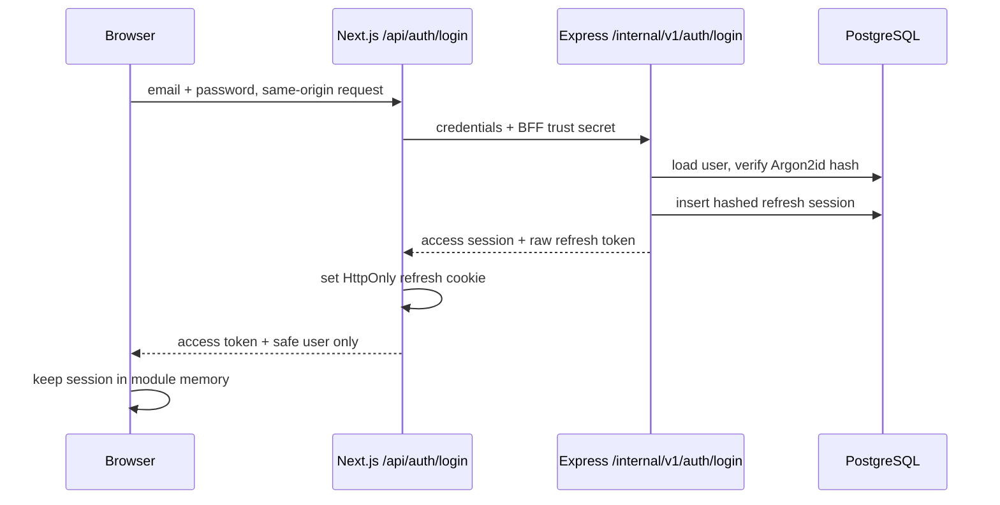

# Authentication

Authentication answers “who is making this request?” Fileora uses Express as the identity authority, PostgreSQL for users and refresh sessions, a narrow Next.js Backend for Frontend (BFF) for browser-safe refresh handling, and memory-only JWT access tokens for normal API calls.

## Credential locations

| Credential | Location | Representation |
| --- | --- | --- |
| Password | PostgreSQL `USER.passwordHash` | Argon2id encoded hash; raw password is never persisted |
| Verification code | PostgreSQL `VERIFICATION_CODE.codeHash` | Argon2id hash of an eight-digit code |
| Access token | Browser module memory | Signed HS256 JWT; not stored in local/session storage or a cookie |
| Refresh token | Same-origin Next.js cookie | Raw random 32-byte base64url value in an `HttpOnly` cookie |
| Refresh session | PostgreSQL `REFRESH_TOKEN` | SHA-256 token hash plus user, expiry, revocation, and creation timestamps |
| BFF trust secret | Next.js/Express server environment | Matching secret sent in `x-gold-era-bff-trust`; never browser-public |

The refresh cookie is host-only because no `Domain` is set. It is `HttpOnly`, uses the configured `Secure` and `SameSite` values, is scoped to `/api/auth`, and has a max age derived from `REFRESH_TOKEN_TTL`. Production client validation requires `Secure=true`.

## Registration and verification

Registration and verification are public browser-to-Express calls; they do not pass through the BFF.

1. The registration form sends name, normalized email, and password to `POST /api/v1/auth/register`.
2. Shared Zod validation requires a name of 1–120 characters, a valid email, and a password of 8–1024 characters.
3. Express hashes the password and a cryptographically random eight-digit verification code with Argon2id.
4. A serializable transaction creates an unverified `USER` with role `USER` and a verification row expiring in ten minutes.
5. After commit, the SMTP adapter sends the raw code. If delivery fails, the account remains created and the API returns `AUTH_VERIFICATION_DELIVERY_PENDING`; the UI routes the user to resend.
6. Verification fetches the newest eligible unused code, compares its hash, atomically marks it used, invalidates other unused codes, and sets `isEmailVerified=true`.

Codes are single-use. Expired, invalidated, used, mismatched, or no-longer-current codes converge on `AUTH_VERIFICATION_INVALID`.

Resend returns a generic message when the account is absent or already verified, preventing account enumeration. For an eligible account it rejects requests within one minute of the latest code or after five codes in the rolling hour, invalidates unused codes, creates a ten-minute replacement, then attempts SMTP delivery.

## Why a BFF exists

Backend for Frontend (BFF) means a server endpoint shaped specifically for this browser client. Fileora's BFF is not a general API proxy. Only these same-origin Next.js routes use it:

- `POST /api/auth/login`
- `POST /api/auth/refresh`
- `POST /api/auth/logout`

Each rejects a request whose `Origin` does not match the effective application origin. Next.js then calls the corresponding `/internal/v1/auth/*` Express endpoint with the shared trust header. Express rejects direct untrusted calls before raw refresh material reaches a controller.

This boundary lets Next.js set and read the `HttpOnly` refresh cookie while Express remains responsible for credential validation, token issuance, session persistence, rotation, and revocation. Browser JavaScript cannot read the cookie, the BFF trust secret, or the raw refresh token returned by Express.

## Login flow

Only verified users can sign in. Bad email/password combinations share `AUTH_INVALID_CREDENTIALS`; an unverified account receives `AUTH_VERIFICATION_REQUIRED`.

Each login creates a separate refresh-token row, so sessions are independently revocable. The access JWT contains subject and role plus issuer `gold-era-api`, audience `gold-era-browser`, issued-at, and expiry claims. The server pins HS256 when issuing and verifying it.

## Protected API authentication

`expressClient` sends the current memory access token as `Authorization: Bearer <token>`. Express verifies signature, algorithm, issuer, audience, expiry, subject, and role. It then reloads a verified authority record from PostgreSQL and requires the database role to match the JWT role. This makes deletion, verification state, and role changes authoritative immediately rather than trusting a stale token until expiry.

Missing bearer credentials return `AUTH_REQUIRED`. Invalid, expired, stale-role, or otherwise unusable bearer credentials currently return `AUTH_ACCESS_INVALID`.

## Refresh and rotation

Refresh-token rotation means each accepted refresh token is revoked and replaced rather than reused.

1. On app startup, `AuthProvider` calls `renewSession()`; the access token is intentionally absent after a reload.
2. The browser posts to the same-origin `/api/auth/refresh`. The cookie is attached automatically but remains unreadable to JavaScript.
3. Next.js reads the cookie server-side and forwards it to trusted Express.
4. Express SHA-256 hashes the raw value and, in a serializable transaction, requires an existing unrevoked, unexpired token whose user remains verified.
5. Express conditionally revokes the old row and creates a replacement hash. A second concurrent/replayed use cannot revoke the same row and receives `AUTH_REFRESH_INVALID`.
6. Express issues a new access JWT and returns the replacement raw refresh value to Next.js.
7. Next.js replaces the cookie and returns only the safe access session to the browser.

`renewSession` uses one shared in-flight promise. This is important because two simultaneous API failures must not submit the same one-time refresh credential twice.

The Axios response interceptor retries a protected request once when it receives a `401` with `AUTH_ACCESS_INVALID` or `AUTH_ACCESS_EXPIRED`. It marks the request to prevent loops, renews the session, updates the bearer header, and replays it. Renewal failure clears memory auth state.

If refresh is missing or Express rejects it, Next.js clears the cookie. A network/service failure returns `503`; the cookie is not explicitly cleared in that catch path, allowing a later retry.

## Logout and revocation

Logout posts to the same-origin BFF, which forwards the presented refresh value to Express. Express hashes it and idempotently sets `revokedAt` on the matching active row. Missing, unknown, or already-revoked values still produce a successful logout result.

The BFF clears its cookie in a `finally` block even when Express is unavailable. The client clears its memory access session and removes auth-prefixed React Query data in a `finally` block as well. If remote revocation could not be confirmed, the database row may remain usable until expiry by a holder of that raw token, but this browser no longer retains the cookie.

There is no logout-all-devices API. Role changes revoke every refresh session for the target user; permanent user deletion removes their refresh rows. A current access token also becomes unusable after a role change because its role no longer matches PostgreSQL.

## Frontend route behavior

`(protected)/layout.tsx` waits for session restoration and redirects anonymous users to `/login?next=<path>`. The admin layout renders a forbidden state unless the restored safe user has role `ADMIN`. `GuestRoute` wraps the landing and authentication layouts, waits for the same restoration, and redirects an already-authenticated session to `/dashboard`. These are navigation and UX controls, not the security boundary: Express still authenticates every protected endpoint and enforces administrator roles.

See [Authorization](authorization.md), [Client API and Data Fetching](client/api-and-data-fetching.md), and [Server Request Lifecycle](server/request-lifecycle.md).
